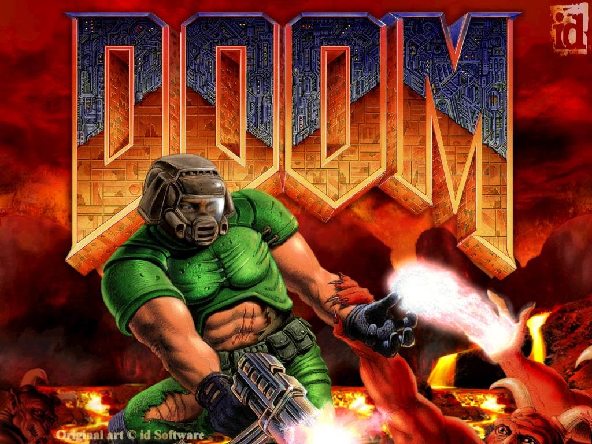

# Artificial-Intelligent-Doom-player

DOOM RL Agent
Agent made with OpenAI using basic heuristics of a point based system to win the the game.

#### 7/25/2017
DQN with Tensorflow added
#### 9/23/2018
Policy Interation added

Value Iteration added

# Install ppaquette to visualize Doom:
pip install ppaquette-gym-doom 

# Install ffmpeg to get the videos in a folder:
conda install -c conda-forge ffmpeg=3.2.4 
